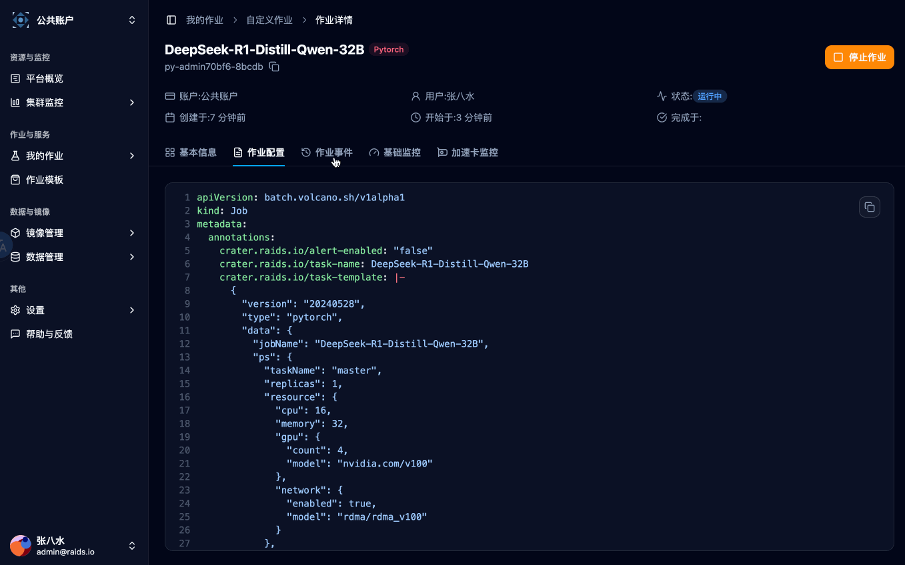
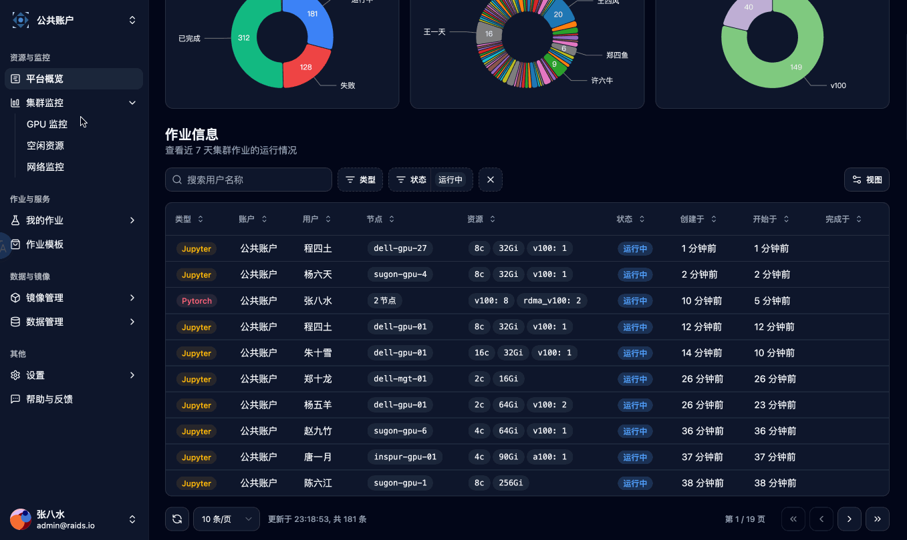
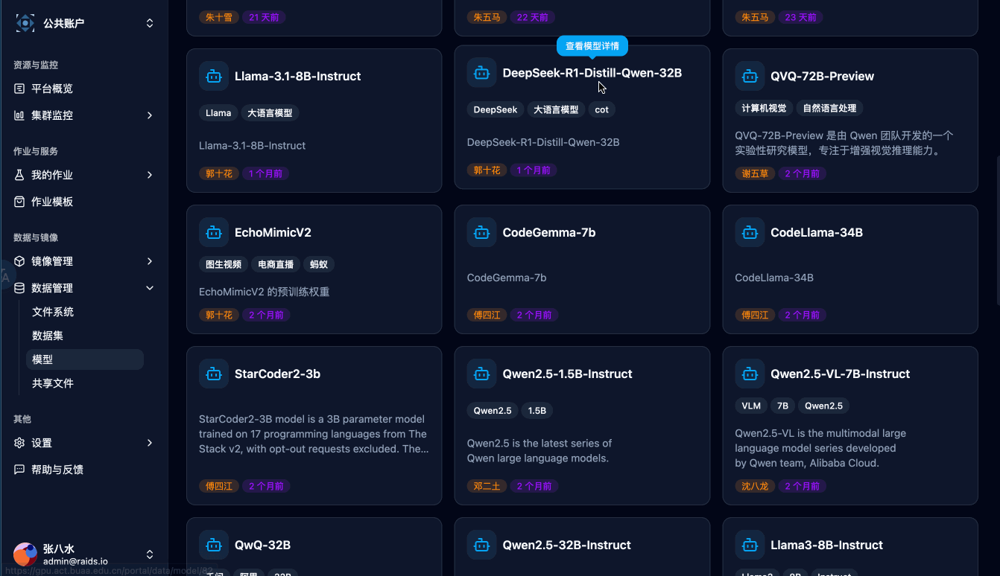

# 🌋 Crater Frontend

Crater is a Kubernetes-based GPU cluster management system providing a comprehensive solution for GPU resource orchestration.

<table>
  <tr>
    <td align="center" width="200px">
      <br>
      <em>Jupyter Lab</em>
    </td>
    <td align="center" width="200px">
      <br>
      <em>Ray Job</em>
    </td>
  </tr>
  <tr>
    <td align="center" width="200px">
      <br>
      <em>Monitor</em>
    </td>
    <td align="center" width="200px">
      <br>
      <em>Models</em>
    </td>
  </tr>
</table>

## 🛠️ Environment Setup

> [!NOTE]
> Install Node.js and Pnpm: [Official Download](https://nodejs.org/en/download)

Ensure you have Node.js and pnpm installed. We recommend using [nvm](https://github.com/nvm-sh/nvm) for Node.js version management.

Verify installations:

```bash
node -v  # Should show v22.x or higher
pnpm -v   # Should show v10.x or higher
```

## 💻 Development Guide

### Project Configuration

For VS Code users:

1. Import `.vscode/React.code-profile` via `Profiles > Import Profile`
2. Install recommended extensions

For other IDEs, manually configure:

- Prettier
- ESLint
- Tailwind CSS IntelliSense

Clone and initialize:

```bash
git clone https://github.com/raids-lab/crater-frontend.git
cd crater-web-frontend
pnpm install
```

Create `.env.development` with:

```env
VITE_API_BASE_URL="http://localhost:8098/"
VITE_USE_MSW=false  # Enable API mocking
PORT=5180           # Dev server port
```

Start development server:

```bash
make run
```

### Core Technologies 🚀

- **Language**: TypeScript
- **Framework**: React 19
- **State Management**: Jotai
- **Data Fetching**: TanStack Query v5
- **Styling**: Tailwind CSS
- **UI Libraries**:
  - shadcn/ui (headless components)
  - Flowbite (Tailwind templates)
  - TanStack Table (headless tables)

### API Mocking 🧪

Use MSW for API simulation during development:

1. Set `VITE_USE_MSW=true` in `.env.development`
2. Add handlers in `src/mocks/handlers.ts`

### Dependency Management 📦

Check updates:

```bash
pnpm outdated
```

Update dependencies:

```bash
pnpm update       # Minor updates
pnpm update --latest  # Major updates (use cautiously)
```

Update shadcn components:

```bash
for file in src/components/ui/*.tsx; do
  pnpm dlx shadcn-ui@latest add -y $(basename "$file" .tsx)
done
```

## 🚀 Deployment

```bash
pnpm build
```

## 📁 Project Structure

```
src/
├── components/           # Reusable components
│   ├── custom/           # Custom components
│   ├── layout/           # App layouts
│   └── ui/               # shadcn components
├── hooks/                # Custom hooks
├── lib/                  # Utilities
├── pages/                # Route-based pages
│   ├── Admin/            # Admin interfaces
│   ├── Portal/           # Job management
│   └── ...               # Other sections
├── services/             # API services
├── stores/               # State management
├── types/                # TypeScript types
└── ...
```

## 🐛 Known Issues

1. **Dark Mode Input Styling**: Browser autofill causes white backgrounds in dark mode ([TailwindCSS#8679](https://github.com/tailwindlabs/tailwindcss/discussions/8679))
